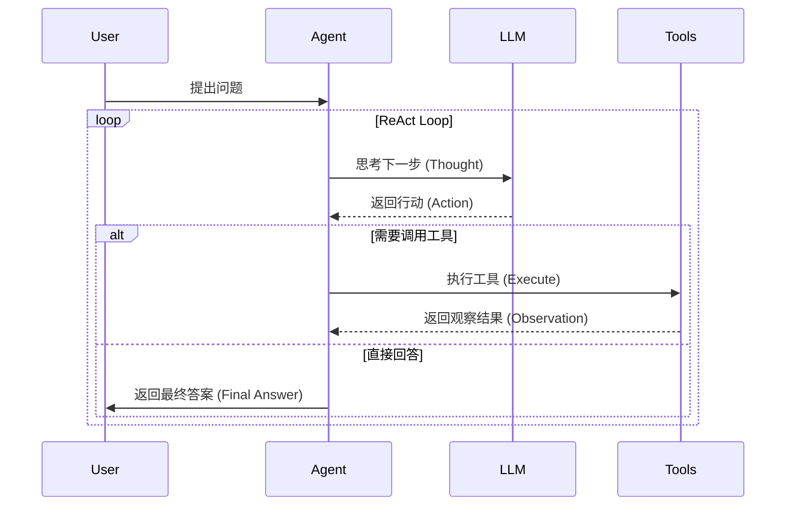

# AI All-in-One Agent (AI Code Helper)

> 您的智能工作与生活伙伴 | Your Intelligent Partner for Work and Life

本项目是一个基于 **Spring Boot** 和 **Vue 3** 的全能 AI 助手平台，集成了多种垂直领域的智能体（Agent），采用 **LangChain4j** 框架实现 ReAct 架构、RAG（检索增强生成）和工具调用功能。

## ✨ 核心功能 (Features)

平台内置了六大智能助手模式：

1.  **💻 编程助手 (Code Agent)**
    *   解答 Java, Python, Vue, Spring 等技术难题。
    *   提供代码生成、调试建议和架构优化方案。
    *   支持 RAG 检索本地技术文档。

2.  **✈️ 旅游助手 (Travel Agent)**
    *   规划旅行路线、推荐景点和美食。
    *   提供签证、交通和住宿建议。

3.  **📝 作文老师 (Essay Teacher)**
    *   辅助写作，提供审题、立意、结构建议。
    *   精批细改，优化文采和逻辑。

4.  **📚 素材百科 (Material Encyclopedia)**
    *   提供丰富的写作素材、名言警句、历史典故。
    *   扩充文章内涵。

5.  **🏥 医疗助手 (Medical Assistant)**
    *   提供健康咨询、症状初筛和养生建议。
    *   *注意：建议仅供参考，不可替代专业医生诊断。*

6.  **🎓 升学规划 (College Planning)**
    *   提供院校排名、专业解读、就业前景分析。
    *   辅助考研和留学规划。

## 🛠️ 技术栈 (Tech Stack)

### Backend (后端)
*   **Java 21**: 最新 LTS 版本。
*   **Spring Boot 3.5.3**: 核心 Web 框架。
*   **LangChain4j 1.0.0-beta1**: Java 版 LLM 应用开发框架。
    *   支持 **ReAct Agent** 架构（思考-行动-观察循环）。
    *   支持 **RAG** (Retrieval-Augmented Generation)。
    *   支持 **MCP** (Model Context Protocol)。
*   **MySQL**: 持久化存储用户、会话和消息数据。
*   **MyBatis-Plus**: ORM 框架。
*   **Alibaba DashScope (Qwen)**: 底座大模型 (通义千问)。

### Frontend (前端)
*   **Vue 3**: 渐进式 JavaScript 框架。
*   **Vite**: 下一代前端构建工具。
*   **Pinia**: 状态管理库。
*   **Vue Router**: 路由管理。
*   **Markdown CSS**: 美化的 Markdown 渲染样式。

## 🚀 快速开始 (Getting Started)

### 1. 环境准备
*   JDK 21+
*   Node.js 18+
*   MySQL 8.0+
*   Maven 3.6+

### 2. 数据库设置
1.  创建数据库 `ai_code_helper`。
2.  执行 `sql/create_table.sql` 脚本初始化表结构。

### 3. 后端启动
1.  进入项目根目录。
2.  修改 `src/main/resources/application.yml` 中的数据库配置（`username`, `password`）和 API Key。
3.  运行启动类：`com.star.aicodehelper.AiCodeHelperApplication`。

```bash
mvn spring-boot:run
```

### 4. 前端启动
1.  进入前端目录：
    ```bash
    cd ai-code-helper-frontend
    ```
2.  安装依赖：
    ```bash
    npm install
    ```
3.  启动开发服务器：
    ```bash
    npm run dev
    ```

## 📂 目录结构 (Directory Structure)

```
ai-code-helper/
├── ai-code-helper-frontend/  # 前端 Vue 项目
│   ├── src/
│   │   ├── api/              # API 接口
│   │   ├── components/       # Vue 组件
│   │   ├── stores/           # Pinia 状态管理
│   │   └── views/            # 页面视图
├── sql/                      # SQL 脚本
├── src/
│   ├── main/
│   │   ├── java/com/star/aicodehelper/
│   │   │   ├── agent/        # Agent 核心逻辑 (ReAct)
│   │   │   ├── ai/           # AI 服务与工具配置
│   │   │   ├── controller/   # Web 控制器
│   │   │   ├── service/      # 业务逻辑服务
│   │   │   └── model/        # 实体类
│   │   └── resources/
│   │       ├── docs/         # RAG 知识库文档
│   │       └── application.yml # 配置文件
└── pom.xml                   # Maven 依赖配置
```

## 🏗️ 项目架构 (Architecture)

### 1. 技术架构图
```mermaid
graph TD
    User[用户] --> Frontend[Vue 3 前端]
    Frontend --> |REST API| Backend[Spring Boot 后端]
    Backend --> |SQL| MySQL[MySQL 数据库]
    Backend --> |API Call| LLM[通义千问大模型]
    Backend --> |Search| RAG[本地知识库检索]
    
    subgraph "Backend Core"
    Controller --> Service
    Service --> Agent[ReAct Agent Engine]
    Agent --> Tools[工具集 (搜索/RAG/计算)]
    end
```

### 2. 核心流程 (Agent Flow)


## 🤝 贡献 (Contribution)
欢迎提交 Issue 和 Pull Request！

## 📄 许可证 (License)
MIT License
