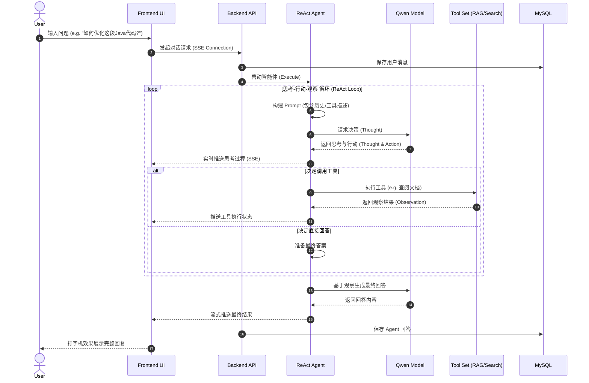

# AI All-in-One Agent (AI Code Helper)

> 您的智能工作与生活伙伴 | Your Intelligent Partner for Work and Life

本项目是一个基于 **Spring Boot** 和 **Vue 3** 的全能 AI 助手平台，集成了多种垂直领域的智能体（Agent），采用 **LangChain4j** 框架实现 ReAct 架构、RAG（检索增强生成）和工具调用功能。

## ✨ 核心功能 (Features)

平台内置了六大智能助手模式：

1.  **💻 编程助手 (Code Agent)**
    *   解答 Java, Python, Vue, Spring 等技术难题。
    *   提供代码生成、调试建议和架构优化方案。
    *   支持 RAG 检索本地技术文档。

2.  **✈️ 旅游助手 (Travel Agent)**
    *   规划旅行路线、推荐景点和美食。
    *   提供签证、交通和住宿建议。

3.  **📝 作文老师 (Essay Teacher)**
    *   辅助写作，提供审题、立意、结构建议。
    *   精批细改，优化文采和逻辑。

4.  **📚 素材百科 (Material Encyclopedia)**
    *   提供丰富的写作素材、名言警句、历史典故。
    *   扩充文章内涵。

5.  **🏥 医疗助手 (Medical Assistant)**
    *   提供健康咨询、症状初筛和养生建议。
    *   *注意：建议仅供参考，不可替代专业医生诊断。*

6.  **🎓 升学规划 (College Planning)**
    *   提供院校排名、专业解读、就业前景分析。
    *   辅助考研和留学规划。

## 🛠️ 技术栈 (Tech Stack)

### 💻 Backend (后端)
*   **Java**: 21 (LTS) - 利用最新的语言特性（如虚拟线程、Record、Switch Pattern）。
*   **Spring Boot**: 3.5.3 - 核心 Web 框架，提供自动配置和依赖注入。
*   **LangChain4j**: 1.0.0-beta1 - Java 版 LLM 应用开发框架，对标 Python LangChain。
    *   **Agent**: ReAct 架构实现（Reasoning + Acting）。
    *   **RAG**: 高级检索增强生成（Advanced RAG），支持文档切片、向量化。
    *   **Tools**: 支持函数调用（Function Calling）和 MCP 协议集成。
    *   **Memory**: 支持 MessageWindow 和 TokenWindow 记忆管理。
*   **Alibaba DashScope (Qwen)**: 接入通义千问大模型（qwen-turbo / qwen-plus）。
*   **MyBatis-Plus**: 3.5.7 - ORM 框架，简化 CRUD 操作。
*   **MySQL**: 8.0+ - 关系型数据库，存储用户数据和会话历史。
*   **Lombok**: 简化 Java 代码（Getter/Setter/Builder）。
*   **Jsoup**: HTML 解析库，用于网页内容抓取工具。
*   **Maven**: 项目构建和依赖管理工具。

### 🎨 Frontend (前端)
*   **Vue**: 3.4+ - 渐进式 JavaScript 框架，使用 Composition API (Setup Syntax)。
*   **Vite**: 5.0+ - 下一代前端构建工具，极速冷启动。
*   **Pinia**: 2.1+ - Vue 的专属状态管理库，替代 Vuex。
    *   持久化存储（LocalStorage）用户偏好和会话状态。
*   **Vue Router**: 4.0+ - 前端路由管理，支持历史模式。
*   **Axios**: HTTP 客户端，处理 RESTful API 请求。
*   **EventSource (SSE)**: 处理 Server-Sent Events，实现流式打字机效果。
*   **Markdown-it / Marked**: Markdown 渲染引擎，支持代码高亮。
*   **Highlight.js**: 代码块语法高亮。
*   **CSS3 Variables**: 实现动态主题切换（如不同 Agent 的配色方案）。

### 🔧 DevOps & Tools (开发工具)
*   **Git**: 版本控制。
*   **IntelliJ IDEA**: 后端开发 IDE。
*   **VS Code**: 前端开发 IDE。
*   **Postman / Apifox**: API 接口调试。
*   **Mermaid**: 流程图和架构图绘制。

## 🚀 快速开始 (Getting Started)

### 1. 环境准备
*   JDK 21+
*   Node.js 18+
*   MySQL 8.0+
*   Maven 3.6+

### 2. 数据库设置
1.  创建数据库 `ai_code_helper`。
2.  执行 `sql/create_table.sql` 脚本初始化表结构。

### 3. 后端启动
1.  进入项目根目录。
2.  修改 `src/main/resources/application.yml` 中的数据库配置（`username`, `password`）和 API Key。
3.  运行启动类：`com.star.aicodehelper.AiCodeHelperApplication`。

```bash
mvn spring-boot:run
```

### 4. 前端启动
1.  进入前端目录：
    ```bash
    cd ai-code-helper-frontend
    ```
2.  安装依赖：
    ```bash
    npm install
    ```
3.  启动开发服务器：
    ```bash
    npm run dev
    ```

## 📂 目录结构 (Directory Structure)

```
ai-code-helper/
├── ai-code-helper-frontend/  # 前端 Vue 项目
│   ├── src/
│   │   ├── api/              # API 接口
│   │   ├── components/       # Vue 组件
│   │   ├── stores/           # Pinia 状态管理
│   │   └── views/            # 页面视图
├── sql/                      # SQL 脚本
├── src/
│   ├── main/
│   │   ├── java/com/star/aicodehelper/
│   │   │   ├── agent/        # Agent 核心逻辑 (ReAct)
│   │   │   ├── ai/           # AI 服务与工具配置
│   │   │   ├── controller/   # Web 控制器
│   │   │   ├── service/      # 业务逻辑服务
│   │   │   └── model/        # 实体类
│   │   └── resources/
│   │       ├── docs/         # RAG 知识库文档
│   │       └── application.yml # 配置文件
└── pom.xml                   # Maven 依赖配置
```

## 🏗️ 项目架构 (Architecture)

### 1. 系统架构设计 (System Architecture)
```mermaid
graph TD
    User[用户 User] --> |Browser| Frontend[前端 Frontend (Vue 3 + Vite)]
    
    subgraph "Presentation Layer"
        Frontend --> |Axios| API[API Client]
        Frontend --> |EventSource| SSE[SSE Stream Listener]
        Frontend --> |State| Pinia[Pinia Store (User/Chat)]
    end
    
    API --> |REST API| Controller[后端 Controller (Spring Boot)]
    SSE --> |Stream| Controller
    
    subgraph "Business Layer"
        Controller --> |Auth| Interceptor[Login Interceptor]
        Controller --> |Logic| Service[Service Layer]
        
        subgraph "Domain Services"
            Service --> AuthService[User Service]
            Service --> ChatService[Chat Service]
            Service --> AIService[AI Capability Service]
        end
    end
    
    subgraph "Intelligent Core (LangChain4j)"
        AIService --> |Orchestrate| AgentEngine[ReAct Agent Engine]
        
        AgentEngine --> |Context| Memory[Message Window Memory]
        AgentEngine --> |Planning| Planner[Chain of Thought]
        AgentEngine --> |Tools| ToolManager[Tool Provider]
        
        ToolManager --> |Search| WebSearch[Web Search]
        ToolManager --> |RAG| Retriever[Document Retriever]
        Retriever --> |Vector| Embed[Embedding Model]
    end
    
    subgraph "Infrastructure & Data"
        AgentEngine --> |Inference| LLM[Alibaba Qwen LLM]
        AuthService --> |CRUD| MySQL[(MySQL Database)]
        Retriever --> |Load| Knowledge[(Local Markdown Knowledge)]
    end
```

### 2. 智能体工作流 (Agent Workflow)


## 🤝 贡献 (Contribution)
欢迎提交 Issue 和 Pull Request！

## 📄 许可证 (License)
MIT License
