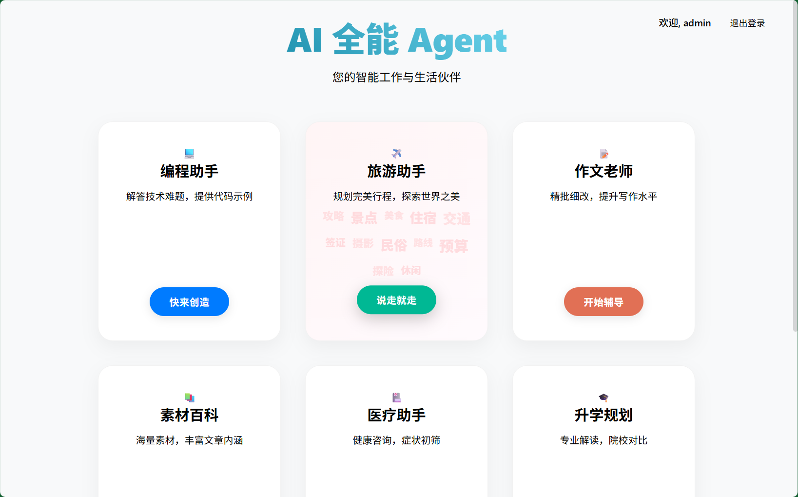
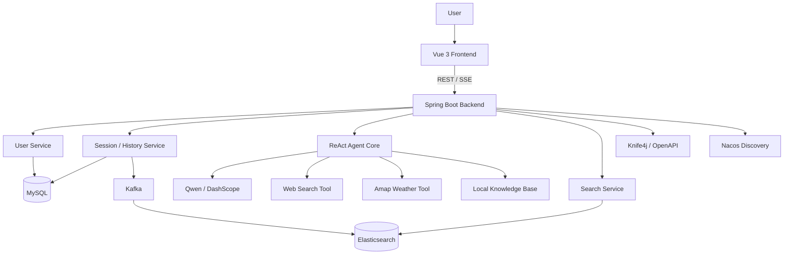
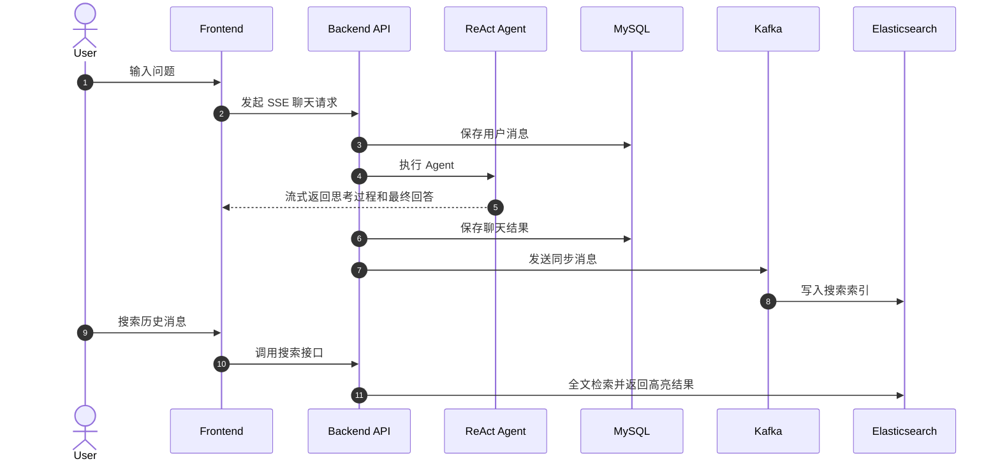

# AI All-in-One Agent (AI Code Helper)

> 您的智能工作与生活伙伴 | Your Intelligent Partner for Work and Life

本项目是一个基于 `Spring Boot + Vue 3` 的多助手 AI 平台，支持 6 类垂直领域助手、流式聊天、会话管理、全文搜索、知识库检索和工具调用。后端基于 `LangChain4j` 实现 ReAct Agent，前端通过 `SSE` 实现打字机式实时输出。



## ✨ 核心功能

### 1. 六大助手模式
平台内置以下 6 个助手模式：

1. **💻 编程助手**
   适合解答 Java、Python、Vue、Spring 等技术问题，支持代码建议、调试思路和本地知识库检索。
2. **✈️ 旅游助手**
   支持行程规划、景点推荐、天气查询、交通与住宿建议。
3. **📝 作文老师**
   支持审题、立意、结构优化、修改润色。
4. **📚 素材百科**
   提供名言、典故、案例、论据等写作素材。
5. **🏥 医疗助手**
   提供基础健康咨询、症状初筛和日常养生建议。
6. **🎓 升学规划**
   支持院校比较、专业选择、就业前景和考研留学建议。

### 2. Agent + Skills 能力
- 基于自定义 `ReActAgent` 实现思考、行动、观察循环。
- 支持 `Search`、`Weather` 等工具调用。
- 每个助手模式都可以理解为一套独立的 domain skills：
  - 独立系统提示词：`src/main/resources/system-prompt-*.txt`
  - 独立知识库目录：`src/main/resources/docs/knowledge/*`
- 前端可直接展示 Agent 的思考过程、工具调用和最终回答。

### 3. 密码加密与登录态
- 用户注册时对密码进行加盐加密后再入库。
- 当前实现采用 `Salt + MD5` 的方式进行摘要存储。
- 登录成功后通过 Session 维持登录态。

### 4. 全文搜索
- 聊天记录支持基于 `Elasticsearch` 的全文检索。
- 搜索结果支持高亮展示。
- 首页支持全局聊天搜索，便于跨会话定位历史内容。
- 提供全量同步接口，可将 MySQL 中已有聊天记录同步到 ES。

### 5. API 文档与服务治理
- 集成 `Knife4j / OpenAPI`，便于接口调试与联调。
- 集成 `Nacos Discovery`，支持服务注册与发现。
- 通过 `docker-compose` 可一键拉起 MySQL、Elasticsearch、Kafka、Nacos 等基础设施。

## 🛠️ 技术栈

### Backend
- `Java 21`
- `Spring Boot 3.4.1`
- `LangChain4j 1.1.0 / 1.1.0-beta7`
- `MyBatis-Plus 3.5.7`
- `MySQL 8`
- `Elasticsearch`
- `Kafka`
- `Spring Cloud Alibaba Nacos Discovery`
- `Knife4j OpenAPI 3`
- `Jsoup`
- `Lombok`
- `Maven`

### Frontend
- `Vue 3`
- `Vite`
- `Pinia`
- `Vue Router`
- `Axios`
- `EventSource / SSE`
- `Marked`

### AI / Agent
- `Qwen`（DashScope）
- `Ollama`本地部署
- 自定义 `ReActAgent`
- 本地 Markdown 知识库
- Web 搜索工具
- 高德天气工具

## 🚀 快速开始

### 1. 环境准备
- `JDK 21+`
- `Node.js 18+`
- `Maven 3.6+`
- `MySQL 8+`
- 可选：`Elasticsearch`、`Kafka`、`Nacos`

### 2. 初始化数据库
1. 创建数据库 `ai_code_helper`
2. 执行 `sql/create_table.sql`

### 3. 配置后端
修改 `src/main/resources/application.yml`，至少确认以下配置：

- `spring.datasource.*`
- `langchain4j.community.dashscope.*.api-key`
- `spring.elasticsearch.uris`
- `spring.kafka.bootstrap-servers`
- `spring.cloud.nacos.discovery.server-addr`

### 4. 启动后端

```bash
mvn spring-boot:run
```

默认地址：

- 后端接口：`http://localhost:8081/api`
- Knife4j 文档：`http://localhost:8081/api/doc.html`

### 5. 启动前端

```bash
cd ai-code-helper-frontend
npm install
npm run dev
```

默认地址：

- 前端页面：`http://localhost:5173`

### 6. 使用 Docker Compose 启动基础设施

项目提供了 `docker-compose.yml`，可同时启动以下服务：

- `backend`
- `frontend`
- `db`（MySQL）
- `elasticsearch`
- `kafka`
- `nacos`

常用访问地址：

- 前端：`http://localhost:3001`
- 后端：`http://localhost:8081/api`
- Elasticsearch：`http://localhost:9200`
- Nacos：`http://localhost:8848/nacos`

启动命令：

```bash
docker compose up -d
```

## 📂 目录结构

```text
ai-code-helper/
├── ai-code-helper-frontend/          # 前端 Vue 项目
│   └── src/
│       ├── api/                      # 前端接口封装
│       ├── components/               # UI 组件
│       ├── stores/                   # Pinia 状态管理
│       ├── views/                    # 页面视图
│       └── router/                   # 路由配置
├── sql/                              # 数据库脚本
├── src/main/java/com/star/aicodehelper/
│   ├── agent/                        # Agent 核心逻辑（ReAct / Tool Call）
│   ├── ai/                           # AI 服务、模型与工具
│   ├── config/                       # Web、Knife4j、Kafka 等配置
│   ├── controller/                   # REST / SSE 接口
│   ├── service/                      # 业务服务层
│   ├── mapper/                       # MyBatis Mapper
│   ├── mq/                           # Kafka 同步消费者 / 生产者
│   ├── model/                        # 实体与 ES 文档模型
│   └── esdao/                        # Elasticsearch Repository
├── src/main/resources/
│   ├── docs/knowledge/               # 本地知识库 / assistant skills
│   ├── system-prompt*.txt            # 各助手系统提示词
│   └── application.yml               # 运行配置
├── docker-compose.yml                # 一键启动依赖服务
└── pom.xml                           # Maven 配置
```

## 🏗️ 架构说明

### 1. 整体架构


```mermaid
graph TD
    User[User] --> Frontend[Vue 3 Frontend]
    Frontend -->|REST / SSE| Backend[Spring Boot Backend]

    Backend --> UserService[User Service]
    Backend --> SessionService[Session / History Service]
    Backend --> AgentCore[ReAct Agent Core]
    Backend --> SearchService[Search Service]

    AgentCore --> LLM[Qwen / DashScope]
    AgentCore --> WebTool[Web Search Tool]
    AgentCore --> WeatherTool[Amap Weather Tool]
    AgentCore --> Knowledge[Local Knowledge Base]

    UserService --> MySQL[(MySQL)]
    SessionService --> MySQL
    SessionService --> Kafka[Kafka]
    Kafka --> Elasticsearch[(Elasticsearch)]
    SearchService --> Elasticsearch

    Backend --> Knife4j[Knife4j / OpenAPI]
    Backend --> Nacos[Nacos Discovery]
```

### 2. 聊天与搜索链路


```mermaid
sequenceDiagram
    autonumber
    actor User
    participant FE as Frontend
    participant API as Backend API
    participant Agent as ReAct Agent
    participant DB as MySQL
    participant MQ as Kafka
    participant ES as Elasticsearch

    User->>FE: 输入问题
    FE->>API: 发起 SSE 聊天请求
    API->>DB: 保存用户消息
    API->>Agent: 执行 Agent
    Agent-->>FE: 流式返回思考过程和最终回答
    API->>DB: 保存聊天结果
    API->>MQ: 发送同步消息
    MQ->>ES: 写入搜索索引
    User->>FE: 搜索历史消息
    FE->>API: 调用搜索接口
    API->>ES: 全文检索并返回高亮结果
```


## 📄 License

NONE